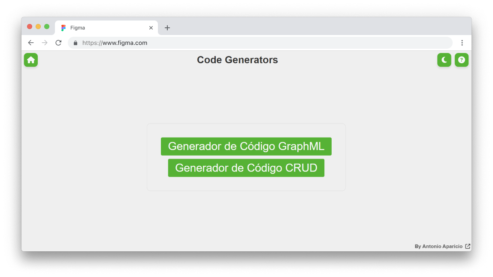
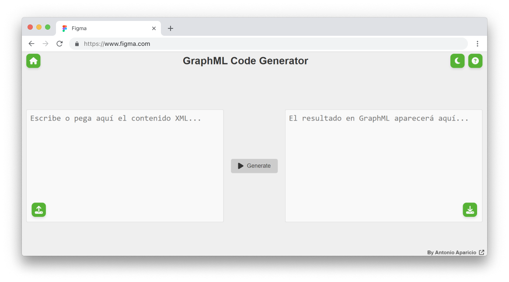
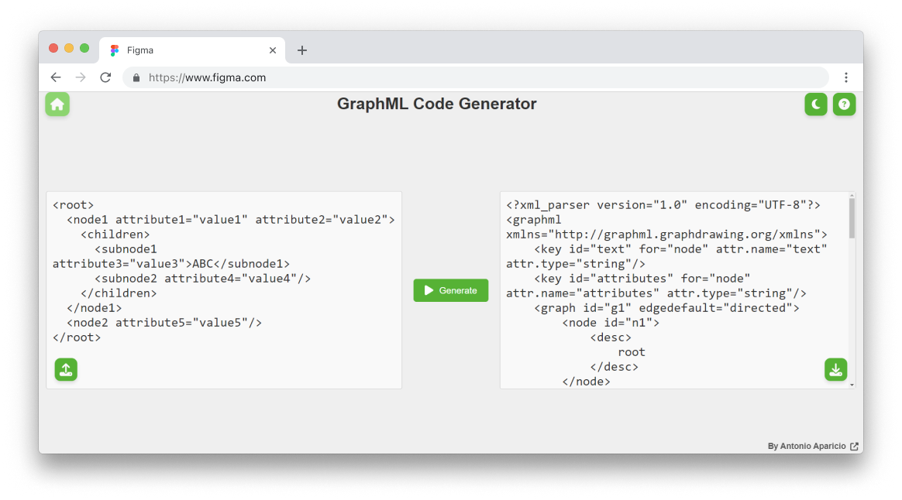
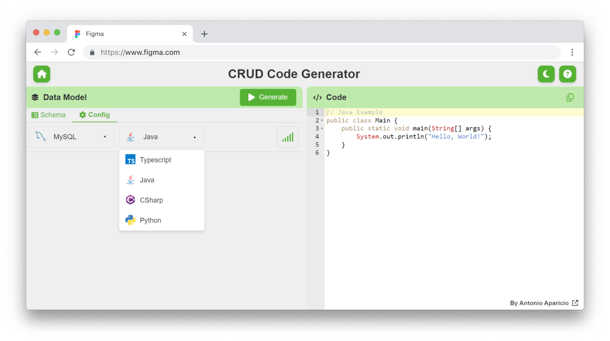
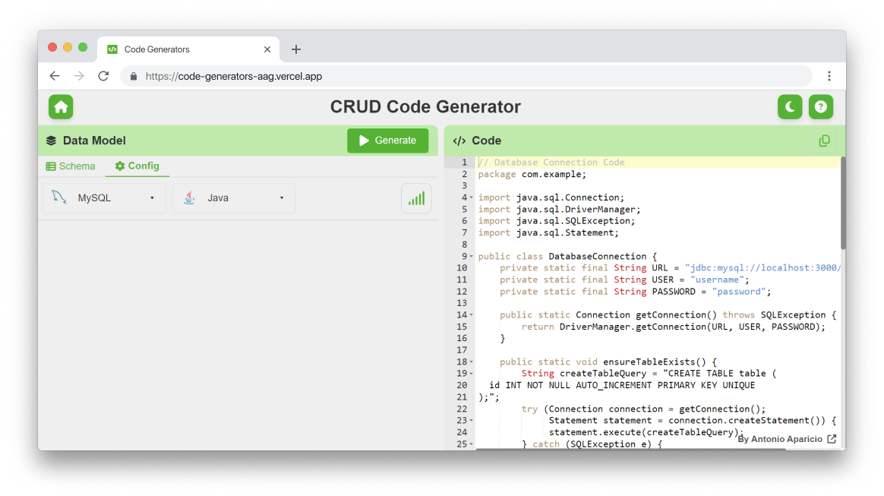

<div style="display: flex; align-items: center; gap: 10px;">
    
    <h1 style="margin: 0; padding-bottom: 10px; font-size: 2em; line-height: 1.5; display: flex; align-items: center;">
        GraphML & CRUD Code Generator
    </h1>
</div>

## 🌐 Aplicaciones Deployadas

Accede a la aplicación en Vercel: [Code Generators en Vercel](https://code-generators-aag.vercel.app/)

---

## 📖 Descripción

**GraphML & CRUD Code Generator** es un conjunto de herramientas diseñadas para cubrir las siguientes necesidades:

1. **GraphML Code Generator**: Convierte contenido XML en GraphML de manera eficiente, ideal para proyectos de
   visualización de grafos.
2. **CRUD Code Generator**: Genera automáticamente código CRUD (Create, Read, Update, Delete) en diferentes lenguajes de
   programación (`Java`, `C#`, `Python`, `TypeScript`) y bases de datos (`MySQL`,`PostgreSQL`, `SQLite`, `Oracle`),
   agilizando el desarrollo de aplicaciones basadas en bases de datos.

Ambas herramientas están compuestas por un frontend moderno y un backend escalable para garantizar una experiencia
fluida y eficiente.

---

## 🎯 Características

### GraphML Code Generator

- **Conversión XML a GraphML**: Transforma archivos XML en GraphML.
- **Interfaz de Usuario Intuitiva**: Fácil de usar y moderna.
- **Desempeño Óptimo**: Rápido y fiable gracias a Vite y FastAPI.

### CRUD Code Generator

- **Soporte Multilenguaje**: Generación de código en Java, Python, C#, y TypeScript.
- **Compatibilidad con Bases de Datos**: PostgreSQL, SQLite, Oracle, entre otras.
- **Personalización de Tablas y Validaciones**: Define estructuras de tablas, tipos de datos y validaciones.
- **Plantillas Dinámicas**: Gestión centralizada de plantillas para un fácil mantenimiento.
- **Interfaz Moderna**: Configura y genera código desde un entorno amigable.

---

## 🚀 Tecnologías Utilizadas

- **Frontend**:
    - Vite
    - React
    - TypeScript
- **Backend**:
    - FastAPI
    - Python
    - Uvicorn
- **Hosting**:
    - Vercel

---

## 📸 Imágenes

### Vista Principal

Aquí tienes una versión mejorada y más atractiva de la sección **📸 Imágenes** del README, con iconos y un diseño más
estilizado utilizando Markdown:

---

## 📸 Imágenes

### 🖥️ Vista Principal

> **Página inicial de la aplicación**  
> Una vista moderna y limpia que conecta las funcionalidades de los generadores.



---

### 🧩 **GraphML Code Generator**

#### 🔄 Ejemplo de Conversión

> **Transforma contenido XML a GraphML en un instante.**

1️⃣ **Antes de la Conversión:**  


2️⃣ **Después de la Conversión:**  


---

### 🛠️ **CRUD Code Generator**

#### 🌟 Generador CRUD

> **Crea tablas, queries y DAOs con unos pocos clics.**

1️⃣ **Selección de Base de Datos y Lenguaje:**
> Personaliza tu configuración inicial para el CRUD.  


2️⃣ **Estructura de la Tabla:**
> Define los campos y sus propiedades para tu tabla.  


3️⃣ **Código Generado:**
> Obtén automáticamente el código para tu proyecto en el lenguaje seleccionado.  


---

---

## 🔧 Configuración Local

Sigue los pasos a continuación para configurar las aplicaciones localmente:

### Requisitos Previos

- Node.js v16 o superior
- Python 3.9 o superior
- Vite y npm instalados

### Pasos para Ejecutar

#### 1. Clona el repositorio

```bash
git clone https://github.com/antonioap101/Code-Generators
cd code-generators
```

#### 2. Configuración del Frontend

```bash
cd frontend
npm install
npm run dev
```

#### 3. Configuración del Backend

```bash
cd ../api
python -m venv venv
source venv/bin/activate  # En Windows: venv\Scripts\activate
pip install -r requirements.txt
uvicorn app:app --reload
```

#### 4. Acceso a las aplicaciones

- **Frontend**: [http://localhost:5173](http://localhost:5173)
- **Backend**: [http://localhost:8000](http://localhost:8000)

---

## 🛠️ Desarrollo y Contribuciones

Si deseas contribuir, abre un **Pull Request** o reporta problemas en la sección
de [Issues](https://github.com/antonioap101/code-generators/issues).

---

## 📝 Licencia

Este proyecto está bajo la licencia **MIT**. Consulta más detalles en el archivo `LICENSE`.

---

## 🌟 ¡Gracias por tu interés en este proyecto!

Si te resulta útil, por favor deja una estrella ⭐ en el repositorio. 😊